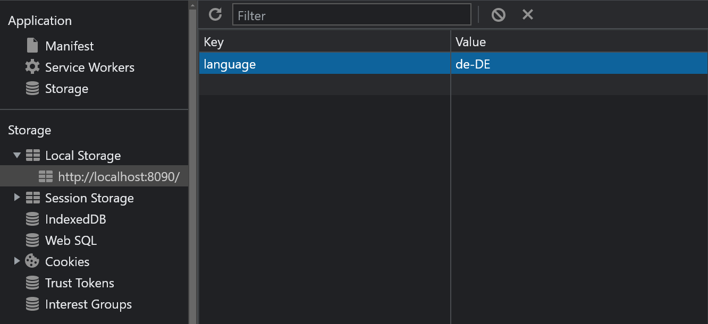

# Coreui Remote Angular Template

## Table of Contents
1. [General Info](#general-info)
2. [What to adjust](#what-to-adjust)
3. [Plugin config template](#plugin-config-template)

# General Info

This project was generated with [Angular CLI](https://github.com/angular/angular-cli) version 12.2.3.

It provides all the fundamental for setting up your angular remote plugin:
- basics dependencies (e.g. `@angular-architects/module-federation`, `@angular/elements`, `@fts/coreui-sdk`)
- `webpack.config.commons.ts` file for a new plugin
- `bootstrap-exported.ts` for an exposed remote module
- background-logic template
- remote module template

### Development server

Run `ng serve` for a dev server. Navigate to `http://localhost:5000/`. The app will automatically reload if you change any of the source files.

### Code scaffolding

Run `ng generate component component-name` to generate a new component. You can also use `ng generate directive|pipe|service|class|guard|interface|enum|module`.

### Build

Run `ng build` to build the project. The build artifacts will be stored in the `dist/` directory.

### Running unit tests

Run `ng test` to execute the unit tests via [Karma](https://karma-runner.github.io).

### Running end-to-end tests

Run `ng e2e` to execute the end-to-end tests via a platform of your choice. To use this command, you need to first add a package that implements end-to-end testing capabilities.

### Further help

To get more help on the Angular CLI use `ng help` or go check out the [Angular CLI Overview and Command Reference](https://angular.io/cli) page.

# What to adjust

> Necessary template points you need to adjust to configure a new angular remote

- [ ] `./angular.json`: port and publicHost for local development server (see [Port already used](#what-to-adjust))
- [ ] `./webpack.config.common.js`: ModuleFederationPlugin `name`
- [ ] `./webpack.config.dev.js`: `uniqueName`
- [ ] `./webpack.config.prod.js`: `publicPath`, `uniqueName`
- [ ] `./src/bootstrap-exported.ts`: `platform` remote module to bootstrap
- [ ] `./src/app/remote-template/remote-template.module.ts`: remote module extra providers and `customElements` definition name

Core files to extend/use as reference:
- `./src/app/remote-template/remote-template.component.ts`
- `./src/app/background-logic/background-logic.ts`

To expose new files as `bootstrap-exported.ts` or `background-logic.ts`, remember to include them in the `ModuleFederationPlugin`. 
Also, make sure they are in the `tsconfig.app.json` via the `files` or `include` property.

### How to adjust pipeline configuration
A default configuration is already present in this file, but **you must delete** the last section that skips the creation of docker and helm artifacts.

### How to adjust module federation shared library
In order to adjust the shared libraries you will need to add the desired libraries to the `./webpack.config.common.js`. 
A default configuration is already present in this file, but there are a few things to keep in mind:
- If you are sharing a library that does not have an internal state that should be valid for all the microfronteds (e.g. rxjs) and the version that you are using is not the same as the shell you need to set the flag `singleton: false`, in order to avoid library conflicts.
- If you are sharing a library that  have an internal state that should be valid for all the microfronteds (e.g. @angular/core) and the version that you are using is not the same as the shell you need to set the flag `shareScope: '<YOUR_SCOPE_NAME>'`, in order to avoid library conflicts, and all others microfrontend that share that package version should have the same `shareScope`. At the time this documentation is written the `shareScope` prevents the conflict but is not sharing the library in the scope as intended. There is an open github issue that you can look at to better understand the problem https://github.com/webpack/webpack/issues/16398.
- Keep in mind that sometimes you need to share deep dependencies (e.g. rxjs/operators and @angular/material/core) if dependencies like this are not shared you may encounter an error like: `TypeError: You provided an invalid object where a stream was expected. You can provide an Observable, Promise, Array, or Iterable`

More information about the `ModuleFederationPlugin` can be found here: https://webpack.js.org/plugins/module-federation-plugin/

> Attention: If you are using Angular v13 make sure that @angular-architects/module-federation is version ~14.2.0

##### If you come from an existing microfrontend
If you are coming from an existing microfrontend you will need to:

- Remove the `eager: true` flag
- Remove the `shareScope: angularVersion` if present
- Follow the steps described in the on top of this section

##### Develop your microfrontend in a standalone way
In order to use the coreui component in a 'standalone' way you need to use this webpack shared library conf:
```javascript
 shared: {
        '@angular/animations': {
          eager: true,
          singleton: true,
          shareScope: angularVersion,
          strictVersion: true,
          requiredVersion: packageDeps.dependencies['@angular/animations']
        },
        '@angular/common': {
          eager: true,
          singleton: true,
          shareScope: angularVersion,
          strictVersion: true,
          requiredVersion: packageDeps.dependencies['@angular/common']
        },
        '@angular/compiler': {
          eager: true,
          singleton: true,
          shareScope: angularVersion,
          strictVersion: true,
          requiredVersion: packageDeps.dependencies['@angular/compiler']
        },
        '@angular/core': {
          eager: true,
          singleton: true,
          shareScope: angularVersion,
          strictVersion: true,
          requiredVersion: packageDeps.dependencies['@angular/core']
        },
        '@angular/elements': {
          eager: true,
          singleton: true,
          shareScope: angularVersion,
          strictVersion: true,
          requiredVersion: packageDeps.dependencies['@angular/elements']
        },
        '@angular/localize': {
          eager: true,
          singleton: true,
          shareScope: angularVersion,
          strictVersion: true,
          requiredVersion: packageDeps.dependencies['@angular/localize']
        },
        '@angular/platform-browser': {
          eager: true,
          singleton: true,
          shareScope: angularVersion,
          strictVersion: true,
          requiredVersion: packageDeps.dependencies['@angular/platform-browser']
        },
        '@angular/platform-browser-dynamic': {
          eager: true,
          singleton: true,
          shareScope: angularVersion,
          strictVersion: true,
          requiredVersion: packageDeps.dependencies['@angular/platform-browser-dynamic']
        },
        '@angular/router': {
          eager: true,
          singleton: true,
          shareScope: angularVersion,
          strictVersion: true,
          requiredVersion: packageDeps.dependencies['@angular/router']
        },
        // Remove this if the MFE doesn't use the coreui-sdk
        '@fts/coreui-sdk': {
          singleton: false,
          strictVersion: false,
          requiredVersion: packageDeps.dependencies['@fts/coreui-sdk']
        },
        // Add this if the MFE adds an element to the DOM
        'rxjs': { eager: true, singleton: false, strictVersion: true, requiredVersion: packageDeps.dependencies['rxjs'] },
        'rxjs/operators': { eager: true, singleton: false, strictVersion: true, requiredVersion: packageDeps.dependencies['rxjs'] },
        'tslib': { eager: true, singleton: false, strictVersion: true, requiredVersion: packageDeps.dependencies['tslib'] },
        'zone.js': { eager: true, singleton: false, strictVersion: true, requiredVersion: packageDeps.dependencies['zone.js'] }
      }
```
We suggest you to still try it in a production like environment (e.g. using the coreui-local-proxy) in order to prevent styling and library share error.
Do not use the above configuration in production as this will make your mfe unable to share the dependencies

### Port already used

- `4200`: coreui-shell
- `4201`: coreui-remote
- `4202`: coreui-remote-debugger
- `4204`: coreui-remote-react
- `4204`: coreui-remote-vue
- `4300`: core-map
- `4301`: lv-mv-awareness
- `4310`: map-layer-loader
- `8082`: tileserver

# Plugin config template

> To integrate the newly created plugin inside the coreui, the plugin-registry must be updated with a new plugin entry

Related confluence page: [Shell / Remotes Configuration Definition](https://wiki.si.siemens.cloud/pages/viewpage.action?pageId=312509293)

###

For local development, update `./coreui-plugin-registry-app/src/main/resources/static/coreui-plugin-registry-config.yaml`
```yaml
- enable: true
  applicationId: 'core'
  id: 'core::left_3'
  description: ''
  microFrontends:
    - type: 'angular'
      remoteEntry: 'http://localhost:5000/remoteEntry.js'
      remoteName: 'coreuiRemoteAngularTemplate'
      exposedModule: './web-components'
      elementName: 'remote-template'
      showAtStartup: true
      anchorPoint:
        ref: 'core::left_area'
  logic:
    - remoteEntry: 'http://localhost:5000/remoteEntry.js'
      remoteName: 'coreuiRemoteAngularTemplate'
      exposedModule: './background-logic'
      elementName: 'remote-template-background-logic'
```
`remoteEntry`, `remoteName`, `exposedModule` are set in the definition of our ModuleFederationPlugin in `./webpack.config.common.js`,
respectively as `filename`, `name` and `exposes` entry. <br/> `elementName` for microFrontends is set in the name definition of a custom element
 at module level (e.g. in `./src/app/remote-template/remote-template.module.ts`), while for logic is arbitrary

###
For production, update `./deployment/helm/templates/coreui-plugin-registry-configmap.yaml`

```yaml
- enable: true
  applicationId: 'core'
  id: 'core::left_3'
  description: ''
  microFrontends:
    - type: 'angular'
      remoteEntry: 'https://fts.gemini.mil.spectrum-power.de/coreui-remote-angular-template/remoteDebuggerEntry.js'
      remoteName: 'coreuiRemoteAngularTemplate'
      exposedModule: './web-components'
      elementName: 'remote-template'
      showAtStartup: true
      anchorPoint:
        ref: 'core::left_area'
  logic:
    - remoteEntry: 'https://fts.gemini.mil.spectrum-power.de/coreui-remote-angular-template/remoteEntry.js'
      remoteName: 'coreuiRemoteAngularTemplate'
      exposedModule: './background-logic'
      elementName: 'remote-template-background-logic'

```

###

> **_NOTE:_** \
> For `logic` entries, you can provide a `loader` optional attribute, which needs to be filled with the elementName of the parent microfrontend.
If not provided, the default loader will be the coreui-shell.

# Configure a Remote-Shell

In order to enable a remote to act as a shell, we need to use some of the CoreUi SDK API:
- `getRemoteChildren`: to retrieve our remote children (microFrontends or logics that specify our elementName as loader) 
- `initChildMicroFrontend`: to load and init one of the children microFrontends retrieved
- `initChildLogic`: to load and init one of the children logics retrieved

This template provides a simple example in the `./src/app/remote-template/remote-template.component.ts` on how to use them.


# Internationalization - i18n
> **_Why i18n?_** \
> You can refer to this confluence page: [ADR-31 - I18N / L10N Support in NGM](https://wiki.si.siemens.cloud/pages/viewpage.action?pageId=276475587) 

This template also includes dependencies and files required for enabling your mfes' internationalization. \
In particular, under `src/assets/i18n` folder, we can find an example of the actual translation files (`de-DE.xlf` and `it-IT.xlf`),
which are generated based on the `messages.xlf`, the entrypoint file, and then provided as configmap under
`deployment/helm/templates` folder.

First we need to mark all the strings we want to internationalize using the `$localize` keyword, like it has been done in the
`src/app/remote-template/remote-template.component.ts` file at line 15:
```javascript
public title = $localize`Your Remote Template Works!`;
```
Afterward, we want to generate the `messages.xlf` file, using the following command: 
```commandline
ng extract-i18n --format xliff2 --output-path src/assets/i18n
```
And the file will look like this:
```xml
<?xml version="1.0" encoding="UTF-8" ?>
<xliff version="2.0" xmlns="urn:oasis:names:tc:xliff:document:2.0" srcLang="en-US">
  <file id="ngi18n" original="ng.template">
    <unit id="7882206348885551412">
      <notes>
        <note category="location">src/app/remote-template/remote-template.component.ts:15</note>
      </notes>
      <segment>
        <source>Your Remote Template Works!</source>
      </segment>
    </unit>
  </file>
</xliff>
```
First we can appreciate the format matching to the one specified by us, xliff 2.0.
But we can also see a single unit corresponding to our specification, with the actual string value as `source` and its location as `note`.

Now, if not already present, we have to manually create the desired files for each destination language (e.g. `de-DE.xlf` and `it-IT.xlf`).
In the process, we can use a program, like [poedit](https://poedit.net/), to generate these files' content.
And their final look should be like this:
```xml
<?xml version="1.0" encoding="UTF-8"?>
<xliff version="2.0" xmlns="urn:oasis:names:tc:xliff:document:2.0" srcLang="en-US" trgLang="de-DE">
  <file id="ngi18n" original="ng.template">
    <unit id="7882206348885551412">
      <notes>
        <note category="location">src/app/remote-template/remote-template.component.ts:15</note>
      </notes>
      <segment state="translated">
        <source>Your Remote Template Works!</source>
        <target>Ihre Remote Template funktioniert!</target>
      </segment>
    </unit>
  </file>
</xliff>
```
The destination language attribute is specified `trgLang="de-DE"`, and our segment, now with `state="translated"`, also contains the translated string value as `target`, other than the `source`.

To locally test the correct application, we can open the `Application` devtool and add the `language` item under `LocalStorage`, like shown in the below image.
After refreshing the page, we should be able to see the new translations in the specified language.


Most of the job has been done. Last but not least we have to update the provided `configmap-i18n.yaml` file under `data` with the newly generated or updated translations.
```yaml
de-DE.xlf: >
    <?xml version="1.0" encoding="UTF-8"?>
    <xliff version="2.0" xmlns="urn:oasis:names:tc:xliff:document:2.0" srcLang="en-US" trgLang="de-DE">
      <file id="ngi18n" original="ng.template">
        <unit id="7882206348885551412">
          <notes>
            <note category="location">src/app/remote-template/remote-template.component.ts:15</note>
          </notes>
          <segment state="translated">
            <source>Your Remote Template Works!</source>
            <target>Ihre Remote Template funktioniert!</target>
          </segment>
        </unit>
      </file>
    </xliff>
```
\
And that's it, great job!
Following this guide we have contributed to Gemini software engagement to support internationalization (I18N)
in order to satisfy all customers around the world.
